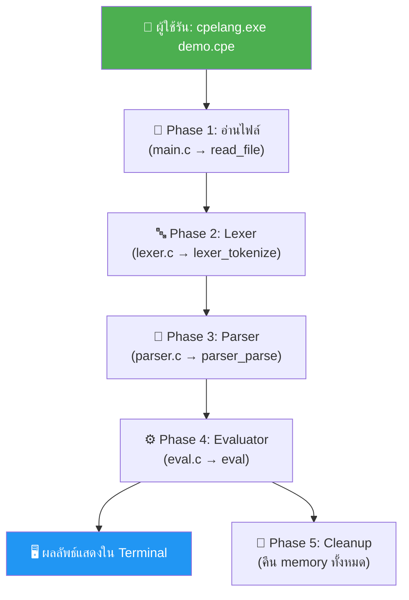
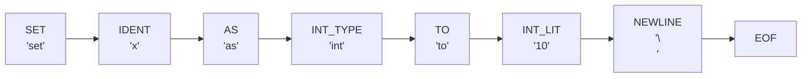
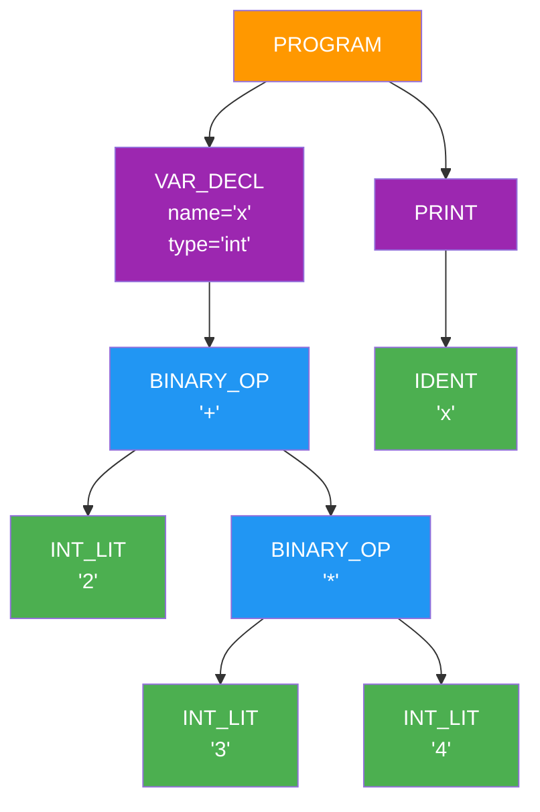
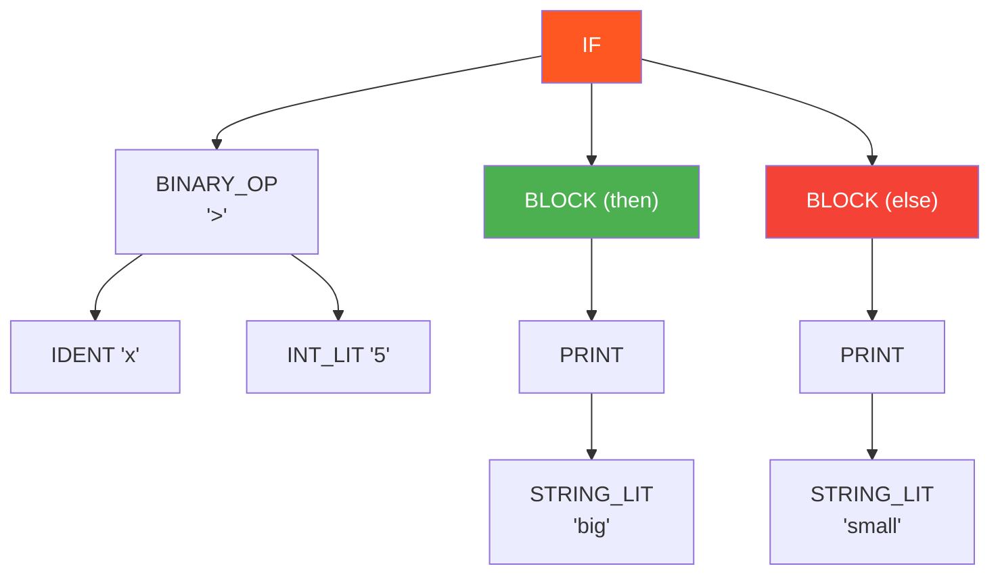
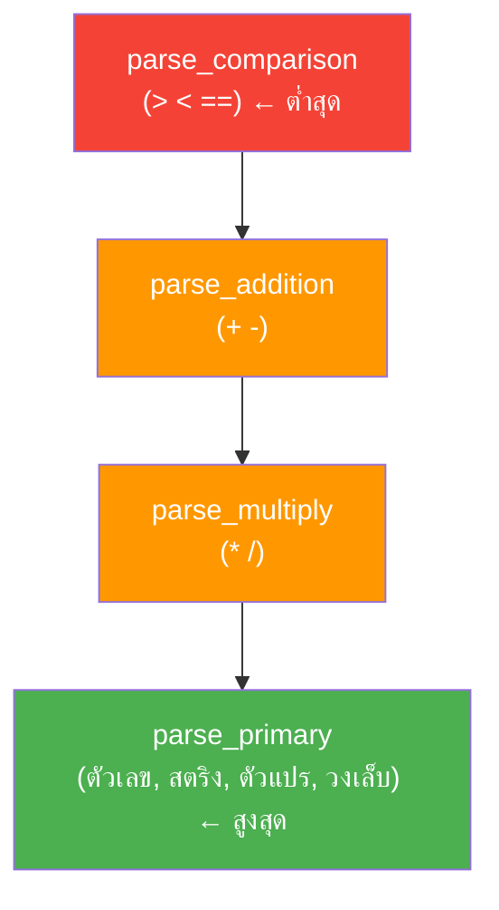
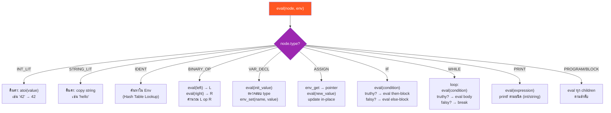
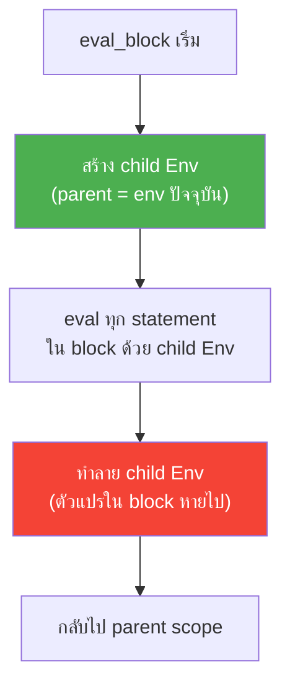
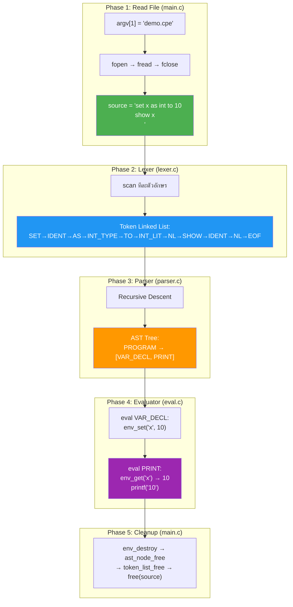

# 🏗️ CPE Language — Architecture & Internal Details

เอกสารนี้อธิบายว่า **interpreter ทำงานภายในอย่างไร** ตั้งแต่รับไฟล์ `.cpe` ไปจนถึงแสดงผลลัพธ์ออกมา พร้อมรายละเอียดของแต่ละไฟล์ โครงสร้างข้อมูล และ Flowchart

---

## 📐 ภาพรวมทั้งหมด — Main Pipeline

เมื่อผู้ใช้รันคำสั่ง `cpelang.exe demo.cpe` จะเกิดเหตุการณ์ 5 ขั้นตอนตามลำดับ:



| Phase | ทำอะไร | Input → Output | ไฟล์ที่รับผิดชอบ |
|-------|--------|----------------|------------------|
| 1. Read File | อ่านไฟล์ `.cpe` ทั้งหมดเข้า memory | file path → `char*` string | `main.c` |
| 2. Lexer | หั่น source code เป็น tokens | `char*` → `TokenList` (Linked List) | `lexer.c` |
| 3. Parser | สร้าง tree จาก tokens | `TokenList` → `ASTNode*` (Tree) | `parser.c` |
| 4. Evaluator | เดิน tree แล้วประมวลผล | `ASTNode*` + `Env*` → ผลลัพธ์ | `eval.c` |
| 5. Cleanup | คืน memory ทั้งหมด | — | `main.c` |

---

## 📄 ไฟล์ทั้งหมดในโปรเจกต์

### Source Code (โฟลเดอร์ `src/`)

| ไฟล์ | บรรทัด | ขนาด | หน้าที่ |
|------|--------|------|---------|
| `main.c` | ~120 | 4.8 KB | **จุดเริ่มต้น** — อ่านไฟล์ `.cpe`, เรียก pipeline ทั้ง 5 phase, จัดการ memory |
| `lexer.h` | ~100 | 6.5 KB | **กำหนดโครงสร้าง** Token, TokenList, TokenType enum |
| `lexer.c` | ~280 | 16 KB | **ตัว Lexer** — scan ทีละตัวอักษร สร้าง Token Linked List |
| `parser.h` | ~110 | 5.5 KB | **กำหนดโครงสร้าง** ASTNode, ASTNodeType enum |
| `parser.c` | ~340 | 18 KB | **ตัว Parser** — Recursive Descent สร้าง AST Tree |
| `env.h` | ~90 | 4.9 KB | **กำหนดโครงสร้าง** Env (Hash Table), Value, EnvEntry |
| `env.c` | ~230 | 10 KB | **Symbol Table** — Hash Table ด้วย djb2 hash + Separate Chaining |
| `eval.h` | ~30 | 1.3 KB | **กำหนด API** ของ Evaluator (eval, eval_block) |
| `eval.c` | ~360 | 16 KB | **ตัว Evaluator** — เดิน AST แล้วประมวลผลทุก node |

### Configuration (โฟลเดอร์ `.vscode/`)

| ไฟล์ | หน้าที่ |
|------|---------|
| `tasks.json` | **Build Task** — กด `Ctrl+Shift+B` แล้วรัน `gcc` compile ไฟล์ C ทั้งหมดเป็น `cpelang.exe` |
| `settings.json` | **Code Runner** — กำหนดว่าเมื่อกด ▶ บนไฟล์ `.cpe` ให้รัน `cpelang.exe <filename>` |

### อื่นๆ

| ไฟล์ | หน้าที่ |
|------|---------|
| `README.md` | คู่มือการใช้งานสำหรับผู้ใช้ทั่วไป |
| `ARCHITECTURE.md` | เอกสารนี้ — รายละเอียดเชิงลึก |
| `examples/demo.cpe` | โปรแกรมตัวอย่างที่ใช้ทุกฟีเจอร์ |

---

## 🔤 Phase 2: Lexer — ตัดคำ (Tokenization)

### หน้าที่

Lexer รับ source code เป็น string แล้ว **scan ทีละตัวอักษร** สร้าง **Token** เรียงตามลำดับเก็บใน **Linked List**

### ตัวอย่างการทำงาน

```
Input:  set x as int to 10
```



### Data Structure: Singly Linked List (with Tail Pointer)

```
TokenList
┌─────────────────┐
│ head ─────────┐  │
│ tail ───────┐ │  │
│ count: 8    │ │  │
└─────────────┼─┼──┘
              │ │
              │ ▼
              │ ┌──────┐    ┌──────┐    ┌──────┐         ┌──────┐
              │ │ SET  │───▶│ IDENT│───▶│  AS  │───▶ ··· │ EOF  │
              │ │ "set"│    │ "x"  │    │ "as" │         │      │
              │ │ ln:1 │    │ ln:1 │    │ ln:1 │         │ ln:1 │
              │ └──────┘    └──────┘    └──────┘         └──────┘
              │                                               ▲
              └───────────────────────────────────────────────┘
```

**ทำไมใช้ Linked List?**

- **Append O(1):** มี tail pointer → เพิ่ม token ที่ท้ายได้ทันทีไม่ต้อง traverse
- **Sequential Access:** Parser อ่าน token จากหัวไปท้ายตามลำดับ → เหมาะกับ Linked List
- **Dynamic Size:** ไม่ต้องรู้ล่วงหน้าว่าจะมีกี่ token

### Keyword Table

Lexer ใช้ตารางนี้แยก keyword ออกจาก identifier:

| Keyword | TokenType | ตัวอย่างใน code |
|---------|-----------|-----------------|
| `set` | TOKEN_SET | `set x as int to 10` |
| `as` | TOKEN_AS | `set x as int to 10` |
| `to` | TOKEN_TO | `set x to 5` |
| `show` | TOKEN_SHOW | `show x` |
| `if` | TOKEN_IF | `if x > 5 then` |
| `else` | TOKEN_ELSE | `else` |
| `while` | TOKEN_WHILE | `while x < 10 do` |
| `then` | TOKEN_THEN | `if x > 5 then` |
| `do` | TOKEN_DO | `while x < 10 do` |
| `end` | TOKEN_END | `end` |
| `int` | TOKEN_INT_TYPE | `set x as int to 10` |
| `string` | TOKEN_STRING_TYPE | `set s as string to "hi"` |

### จุดสำคัญเรื่อง Newline

ภาษา CPE **ไม่ใช้ `;`** → Lexer จะสร้าง `TOKEN_NEWLINE` เมื่อเจอ `\n` แต่**ข้ามซ้ำ**ถ้ามี newline ติดกันหลายบรรทัด (เพื่อไม่ให้ parser ต้องจัดการบรรทัดว่าง)

---

## 🌳 Phase 3: Parser — สร้าง AST

### หน้าที่

Parser รับ Token List แล้วสร้าง **Abstract Syntax Tree (AST)** ด้วยเทคนิค **Recursive Descent Parsing**

### Grammar ของภาษา CPE

```
program    → statement*
statement  → set_stmt | show_stmt | if_stmt | while_stmt

set_stmt   → "set" IDENT "as" TYPE "to" expr NEWLINE     ← ประกาศตัวแปร
           | "set" IDENT "to" expr NEWLINE                ← กำหนดค่าใหม่

show_stmt  → "show" expr NEWLINE

if_stmt    → "if" expr "then" NEWLINE body
             ("else" NEWLINE body)? "end" NEWLINE

while_stmt → "while" expr "do" NEWLINE body "end" NEWLINE

body       → statement*

expr       → comparison
comparison → addition ((">" | "<" | "==") addition)*
addition   → multiply (("+" | "-") multiply)*
multiply   → primary (("*" | "/") primary)*
primary    → INT_LIT | STRING_LIT | IDENT | "(" expr ")"
```

### ตัวอย่าง: AST ที่ได้จากโค้ด

```
set x as int to 2 + 3 * 4
show x
```



### ตัวอย่าง: AST ของ If-Else

```
if x > 5 then
    show "big"
else
    show "small"
end
```



### Data Structure: N-ary Tree

```c
typedef struct ASTNode {
    ASTNodeType  type;           // ประเภท node
    char        *value;          // ค่า literal ("42", "hello")
    char        *name;           // ชื่อตัวแปร ("x", "counter")
    char        *op;             // ตัวดำเนินการ ("+", ">", "==")
    char        *var_type;       // ชนิดตัวแปร ("int", "string")

    struct ASTNode *children[128];  // ← N-ary Tree: child ได้สูงสุด 128 ตัว
    int             child_count;
} ASTNode;
```

**ทำไมใช้ N-ary Tree?**

- **PROGRAM/BLOCK** node มี children เป็น statements จำนวนไม่แน่นอน
- **BINARY_OP** node ใช้ children[0] = ซ้าย, children[1] = ขวา → ทำหน้าที่เป็น Binary Tree
- **IF** node มี 2-3 children: condition, then-block, else-block (ถ้ามี)

### Operator Precedence (ลำดับการคำนวณ)

Parser ใช้ **ลำดับชั้นของฟังก์ชัน** เพื่อจัดลำดับ:



ฟังก์ชันที่อยู่ข้างล่าง (สูงสุด) จะถูกเรียกก่อน ทำให้ `*` `/` ถูกจัดกลุ่มก่อน `+` `-`

---

## 📦 Phase 4 (ส่วนเสริม): Environment — Symbol Table

### หน้าที่

เก็บตัวแปร (ชื่อ → ค่า) โดยใช้ **Hash Table** ด้วย **Separate Chaining**

### Data Structure: Hash Table + Scope Chain

```
Global Env (parent = NULL)
┌────────────────────────────────┐
│  buckets[0] → NULL             │
│  buckets[1] → [x: 10] → NULL  │
│  buckets[2] → NULL             │
│  buckets[3] → [name: "hi"]→ NULL│
│  ...                           │
│  buckets[63] → NULL            │
└──────────────┬─────────────────┘
               │ parent
               ▼
              NULL
```

เมื่อเข้า block (เช่น `if...then...end`) จะสร้าง **child Env** ใหม่:

```
While-Block Env (parent ──▶ Global Env)
┌────────────────────────────────┐
│  buckets[5] → [temp: 3] → NULL│
│  ...                           │
│  parent ──────────────────────────▶ Global Env
└────────────────────────────────┘
```

### Hash Function: djb2

```c
hash = 5381
for each character c:
    hash = hash × 33 + c
return hash % 64   // 64 buckets
```

### Scope Chain Lookup (ค้นหาตัวแปร)


**วิธีการ:** ค้นจาก scope ปัจจุบัน → ถ้าไม่เจอ ไล่ขึ้น parent → ... → ถ้าถึง NULL = ตัวแปรไม่มี (error)

### จุดสำคัญ: Assignment ต้อง Update In-Place

เมื่อ assign ค่าใหม่ (`set x to 5`) ใน block ที่เป็น child scope:

```c
// ❌ ผิด: env_set(child_env, "x", 5)
//    → สร้าง entry ใหม่ใน child scope = shadow ตัวแปรจาก parent
//    → while loop ไม่จบ เพราะตัวแปรจริงไม่ถูก update

// ✅ ถูก: ค้นหาด้วย env_get → ได้ pointer → update ผ่าน pointer
Value *existing = env_get(env, "x");  // ค้นหาตาม scope chain
*existing = new_value;                 // update in-place ที่ scope จริง
```

---

## ⚙️ Phase 4: Evaluator — ประมวลผล

### หน้าที่

**เดิน AST** แบบ recursive (Post-order Traversal) แล้วประมวลผลแต่ละ node

### Flow ของ Evaluator



### Scope Management ใน Block



---

## 🔗 เส้นทางข้อมูลทั้งระบบ (End-to-End Data Flow)

ตัวอย่างจากไฟล์ `demo.cpe` ที่มีเนื้อหา:

```
set x as int to 10
show x
```



---

## 📊 สรุป Data Structures ที่ใช้

| Data Structure | ใช้ที่ไหน | ทำไมถึงเลือกใช้ |
|---|---|---|
| **Singly Linked List** (+ tail pointer) | Token List (Lexer) | Append O(1), Sequential access, ไม่ต้องรู้ขนาดล่วงหน้า |
| **N-ary Tree** (array of children) | AST (Parser) | รองรับ node ที่มี children ไม่แน่นอน (PROGRAM, BLOCK) |
| **Binary Tree** (children[0], children[1]) | Expression nodes ใน AST | แสดง left/right operand ของ binary operation |
| **Hash Table** (djb2 + Separate Chaining) | Symbol Table (Environment) | Lookup O(1) average, Insert O(1), รองรับ collision |
| **Scope Chain** (parent pointer) | Environment nesting | ค้นหาตัวแปรจาก local → enclosing → global |

---

## 🔧 Config Files — วิธีดึง Path

### `.vscode/tasks.json` — Build Task

เมื่อกด `Ctrl+Shift+B`:

```
gcc → อ่านไฟล์จาก ${workspaceFolder}/src/*.c
    → output ไปที่ ${workspaceFolder}/build/cpelang.exe
```

`${workspaceFolder}` คือโฟลเดอร์ที่เปิดใน VS Code = `CPE-Lang/`

### `.vscode/settings.json` — Code Runner

เมื่อกด `Ctrl+Alt+N` บนไฟล์ `.cpe`:

```
$workspaceRoot\build\cpelang.exe $fileName

ตัวอย่างจริง:
C:\...\CPE-Lang\build\cpelang.exe demo.cpe
```

| ตัวแปร | แปลงเป็น | มาจากไหน |
|--------|----------|----------|
| `$workspaceRoot` | `C:\...\CPE-Lang` | โฟลเดอร์ที่เปิดใน VS Code |
| `$dir` | `C:\...\examples\` | โฟลเดอร์ของไฟล์ที่เปิดอยู่ |
| `$fileName` | `demo.cpe` | ชื่อไฟล์ที่เปิดอยู่ |

### `main.c` — อ่าน Path จาก Command Line

```c
int main(int argc, char *argv[]) {
    const char *filename = argv[1];  // "demo.cpe" หรือ "examples/demo.cpe"
    char *source = read_file(filename);
    // ... pipeline ต่อไป
}
```

`argv[1]` คือ argument ตัวแรกที่ผู้ใช้ส่งมา:

```
cpelang.exe examples/demo.cpe
            ^^^^^^^^^^^^^^^^^ argv[1]
```
